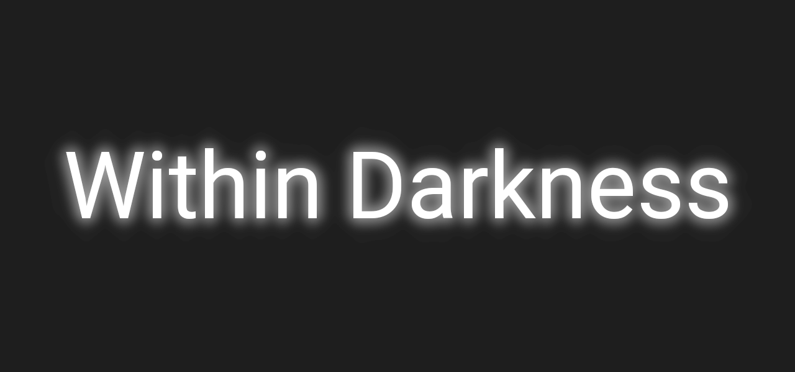

# Within Darkness



_Within Darkness_ is a 2d Action RPG and Shooter game playable in solo or co-op.

The game is coded in C++11.

## Dependencies

[](https://www.sfml-dev.org/index.php)

## How to compile

Using [CMAke](https://cmake.org "cmake.org") to compile is recommended.

**Having access to the repository is needed.**

### Cloning with HTTP

**Github identification is required when cloning with HTTP.**

```
git clone https://github.com/CyBearStudio/within_darkness.git
cd within_darkness
mkdir build
cd build
cmake ..
cmake --build .
```

### Cloning with SSH

**Github SSH key setup is required when cloning with SSH.**

```
git clone git@github.com:CyBearStudio/within_darkness.git
cd within_darkness
mkdir build
cd build
cmake ..
cmake --build .
```


**Don't forget to copy res folder at the root of the executable.**

## Folder structure

__doc/__ contains the technical documentation for developers

__img/__ contains images such as the banner, sreenshots, etc...

__include/__ contains the header files

__res/__ contains the resources of the game (textures, audio, etc...)

__src/__ contains the source files
